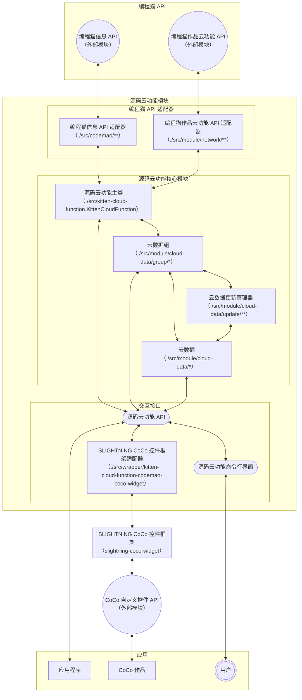

# 

[](https://gitee.com/slightning/Kitten-Cloud-Function) [](https://gitee.com/slightning/Kitten-Cloud-Function/releases/latest) [](https://gitee.com/slightning/Kitten-Cloud-Function/releases) [](https://gitee.com/slightning/Kitten-Cloud-Function/blob/main/LICENSE)

[](https://github.com/S-LIGHTNING/Kitten-Cloud-Function) [](https://github.com/S-LIGHTNING/Kitten-Cloud-Function/releases/latest) [](https://github.com/S-LIGHTNING/Kitten-Cloud-Function/releases) [](https://github.com/S-LIGHTNING/Kitten-Cloud-Function/blob/main/LICENSE)

[](https://www.npmjs.com/package/kitten-cloud-function) 


## <b style="font-size: 2rem; line-height: 2.5rem; color: white; background-color: #C00000">如果你有能力制作源码云功能完整版或破解版等，请不要传播。</b>

## 零、关于 CoCo 控件的说明和相关问题解答

该部分内容中，除特别指明外，“源码云功能”均指“源码云功能（CoCo 控件版）”

### 1.旧版控件不能用了？

是的。近期，CoCo 拦截了作品中对 codemao 相关域名的 WebSocket 连接，导致旧版控件相关功能无法使用。

在最新版的源码云功能使用一些技术手段绕过了这个限制。

### 2.最新版为什么不能修改别人作品的云数据？

导致这个问题的根本原因是你使用的是源码云功能修改受限版。这并不是 CoCo 的限制、源码云功能的功能缺陷或编程猫官方的要求。

### 3.为什么要添加修改受限

源码云功能曾被大量用于恶意篡改他人作品的云数据，这与制作源码云功能这一项目的初心不符。在一次更新中，源码云功能添加了修改受限，以防该工具被用于恶意用途。

### 4.我可以用源码云功能修改他人作品的云数据吗？

从道德上来讲，源码云功能官方既不赞成也不反对使用源码云功能修改他人作品云数据的行为。

从技术上来讲，源码云功能可以修改他人作品的云数据，源码云功能命令行版、代码版和 CoCo 控件专用版都可以修改他人作品的云数据而没有实质性的限制。

注：虽然源码云功能 CoCo 控件专用版严格限制控件用途，但是，这种限制是由构建源码云功能 CoCo 控件专用版的人确定的，任何会构建源码云功能 CoCo 控件专用版的人都可以构建用于任何作品的控件。

### 5.如何使用源码云功能修改他人作品的云数据？

可以使用代码版、命令行版或 CoCo 控件专用版。关于这几个版本的用法，请参考[二、快速开始](#二、快速开始)。

### 6.可以给我源码云功能完整版吗？

**不可以**。源码云功能官方不会向任何组织或个人提供源码云功能完整版、源码云功能完整版的代码或源码云功能完整版的构建教程或文档。

源码云功能完整版功能过于强大，很容易被用于恶意用途。

## 一、介绍

### 1.简介

源码云功能是针对编程猫源码云功能（云变量、云列表等）的客户端工具，提供了多种使用方式。

### 2.主要功能

- 查看、修改编程猫作品的云变量；
- 获取编程猫作品的在线人数；
- 获取当前登录的编程猫用户信息；
- 查看、修改编程猫作品的云列表。

### 3.兼容性

在 Google Chrome 60、最新版的 Mozilla Firefox、Node 14 中测试正常。

CoCo 控件兼容 Creation Project，可在打包后的应用中使用。

### 4.其他

- 该工具的默认配置尽可能地与源码编辑器保持一致。

## 二、快速开始

[CoCo 控件版](#coco-控件版)
[代码版](#代码版)
[命令行版](#命令行版)

### CoCo 控件版

#### 1.获取 CoCo 控件

##### 获取修改受限版

到 [release](https://gitee.com/slightning/Kitten-Cloud-Function/releases/latest) 页面下载最新版本的 CoCo 控件 修改受限版。

修改受限版按照以下规则限制对云数据的修改：

1.在 CoCo 编辑器中，只能修改自己作品的云数据；

2.在已发布的 CoCo 作品中，只能修改该 CoCo 作品的作者的作品的云数据。

3.在 Creation Project 和打包后的应用中不可用。

为实现上述限制，源码云功能需要获取相关作品信息，因此，被连接的作品需要是已发布的；CoCo 作品如果发布，必须发布到社区。

##### 获取专用版

专用版是只能特定的编程猫账号在特定 CoCo 作品中用于特定作品的特殊版本。这种版本严格限制了控件的用途，可以有效防止控件用于其他用途。

专用版在 Creation Project 和打包后的应用中可用。

请参考下面的命令自行构建专用版，建议使用 Node.js 22 及以上版本，多个用户或作品用英文逗号分开。

```bash
USER="你的编程猫账号ID"
USING_WORK="使用控件的CoCo作品的ID"
CONNECTING_WORK="要连接的作品的ID"

git clone https://gitee.com/slightning/Kitten-Cloud-Function.git
cd Kitten-Cloud-Function
npm install
# 生成 CoCo 控件
npx scw-build coco --config webpack.widget.js --env user=$USER --env usingWork=$USING_WORK --env connectingWork=$CONNECTING_WORK
# 生成 Creation Project 1 控件
npx scw-build creationproject1 --env platform=\"Creation Project 1\" --config webpack.widget.js --env user=$USER --env usingWork=$USING_WORK --env connectingWork=$CONNECTING_WORK
# 生成 Creation Project 2 控件
npx scw-build creationproject2 --env platform=\"Creation Project 2\" --config webpack.widget.js --env user=$USER --env usingWork=$USING_WORK --env connectingWork=$CONNECTING_WORK
```

##### 获取完整版

<b style="font-size: 2rem; line-height: 2.5rem; color: white; background-color: #C00000">完整版不应该用在公开作品（包括发布的作品）中。公开作品并不安全，可能导致控件泄露。</b>

由于完整版功能过于强大，源码云功能不提供任何完整版 CoCo 控件和构建完整版 CoCo 控件的说明文档，有需求的请自行摸索。

#### 2.检测用户登陆状态

使用`用户已登录`积木检测用户是否已登录。

提示：可以使用`用户登录`积木让用户登录。

#### 3.连接到云

在进行除获取当前登录的用户信息之外的任何操作都需要在连接到云后进行。

使用`连接 到 (0)`积木进行连接，其中`(0)`填写要连接的作品的 ID。

注意：
- 连接后进行依赖于连接的操作时，会自动等待连接完成。
- 连接云时需要处在未连接状态，如果存在连接，上一个连接会自动断开。

#### 4.查看和修改云数据

该操作与源码编辑器的操作类似，在此不再赘述。

#### 5.获取用户信息

使用`ID 为 (0) 的用户 的 [ID]`积木，当 ID 为 0 时，获取到的是当前登录的用户的信息。

### 代码版

#### 1.引入

##### npm

安装

```
$ npm install kitten-cloud-function
```

导入

```JavaScript
import { KittenCloudFunction } from "kitten-cloud-function"
```

##### 浏览器

```html
<script src="https://unpkg.com/axios@1/dist/axios.min.js"></script>
<script src="https://unpkg.com/diff@7/dist/diff.min.js"></script>
<script src="https://unpkg.com/@slightning/anything-to-string@1/dist/cjs/bundle.min.js"></script>
<script src="https://unpkg.com/kitten-cloud-function@1/dist/kitten-cloud-function-browser.min.js"></script>
<script>
    const { KittenCloudFunction } = window.KittenCloudFunction
    // Your code here...
</script>
```

#### 2.检测用户登陆状态

可以通过尝试获取用户信息来检测用户是否已登录。

```JavaScript
try{
    await KittenCloudFunction.user.info.id
    console.log("用户已登录")
} catch(error) {
    console.log("用户未登录")
}
```

提示：在浏览器中，可以调用`CodemaoUser.userLogInInBrowser`让用户登录；在 Node 中，可以调用`CodemaoUser.setAuthorization`来设置登录凭证。

#### 3.创建连接

```JavaScript
let connection = new KittenCloudFunction(114514)
```

#### 4.查看和修改云数据

##### ①获取云数据实例

```JavaScript
let connection = new KittenCloudFunction(114514)

// 快速获取云数据实例，不推荐使用
let data = await connection.get("云数据")

// 按照类型获取云数据实例
let privateVariable = await connection.privateVariable.get("私有云变量")
let publicVariable = await connection.publicVariable.get("公有云变量")
let list = await connection.list.get("云列表")
```

##### ②查看和修改云变量

```JavaScript
let connection = new KittenCloudFunction(114514)
let variable = await connection.publicVariable.get("云变量")

// 读取云变量的值
console.log(variable.get())

// 修改云变量的值
variable.set("好耶")

// 使用 await 等待上传
await variable.set("好耶！是源码云功能 v1.2.1 更新，我们有救了！")
```

##### ③查看私有云变量排行榜

```JavaScript
let connection = new KittenCloudFunction(114514)
let privateVariable = await connection.privateVariable.get("私有云变量")

// 获取私有云变量排行榜逆序排列的前 31 名用户
let rankList = await privateVariable.getRankingList(31, -1)
for (const item of rankList) {
    console.log(item.value, await item.user.info.nickname)
}
```
##### ④查看和修改云列表

```JavaScript
let connection = new KittenCloudFunction(114514)
let list = await connection.list.get("云列表")

// 获取云列表索引为 1 的项，列表索引从 0 开始
console.log(list.get(1))

// 修改云列表索引为 1 的项
list.replace(1, "好耶")

// 添加云列表第索引为 10 的项，新添加的项的索引为 10
list.add(10, "好耶")

// 删除云列表索引为 1 的项
list.remove(1)
```

更多云列表操作请参考[源码云功能 API 文档](https://s-lightning.github.io/Kitten-Cloud-Function/classes/module_cloud_data_kitten_cloud_list.KittenCloudList.html)。

#### 5.更多功能

请参考[源码云功能 API 文档](https://s-lightning.github.io/Kitten-Cloud-Function/hierarchy.html)。

### 命令行版

需要 Node.js 16 及以上版本。

#### 1.安装

```
$ npm install kitten-cloud-function -g
```

#### 2.设置身份

```
$ kcf set-authorization
```

身份即 Cookie 中的 authorization。

#### 3.设置作品

```
$ kcf use <work-id>
```

#### 4.进行云操作

请参考：

```
$ kcf help
```

#### 5.退出

```
$ kcf exit
```

## 三、功能配置

### 1.自动重连

当连接异常断开时，如果允许，会在等待指定时间后自动重连。

### 2.本地预更新

在没有开启本地预更新时，每次在本地执行数据更新操作时，都会等到该操作同步到云端并收到来自服务器的反馈后再更新本地的数据，这与普通的变量在修改后立即更新其值并不相同。

如：

```JavaScript
let connection = new KittenCloudFunction(114514)

// 假设该变量初始值为 0
let variable = await connection.publicVariable.get("云变量")

// 此处应输出 0
console.log(variable.get())

// 修改变量的值，要等到该操作同步到云端并收到来自服务器的反馈后才能生效
variable.set(666)

// 此处仍然输出 0，因为对该变量的修改操作还没有同步到云端
console.log(variable.get())
```

开启本地预更新后，本地执行数据更新操作时，会假定该操作同步到云端之前没有其它用户对该数据进行操作，并基于此提前更新本地的数据，如果假定不成立，则会修正本地数据。具体而言，本地执行数据更新操作时，会立即更新本地的数据，如果在当前操作被同步到云端之前收到了来自服务器的反馈的其它更新数据，则会撤销本地对数据的更改，并执行来自云端的更改，最后再执行本地对数据的更改。

### 3.更多功能配置

请参考[源码云功能 API 文档](https://s-lightning.github.io/Kitten-Cloud-Function/classes/module_kitten_cloud_function_config_layer.KittenCloudFunctionConfigLayer.html)。

## 四、技术信息

### 1.使用到的技术或工具

- 编程语言
    - [TypeScript](https://www.typescriptlang.org/)
- 打包工具
    - [webpack](https://webpack.js.org/)
- 代码兼容性
    - [Babel](https://babeljs.io/)
    - [Promise.any](https://github.com/ungap/promise-any#readme)
- 文档生成
    - [TypeDoc](https://typedoc.org/)
- 命令行
    - [Commander.js](https://github.com/tj/commander.js#readme)
    - [Readline for Passwords](https://github.com/jlyonsmith/readline-password#readme)
    - [chalk](https://github.com/chalk/chalk#readme)
- CoCo 控件适配
    - [SLIGHTNING CoCo 控件框架](https://s-lightning.github.io/slightning-coco-widget/)
- 其他
    - [](https://axios-http.com/)
    - [Anything To String](https://github.com/S-LIGHTNING/anything-to-string#readme)
    - [jsdiff](https://github.com/kpdecker/jsdiff#readme)
    - [appdirsjs](https://github.com/codingjerk/appdirsjs#readme)

### 2.系统模块关系结构图


